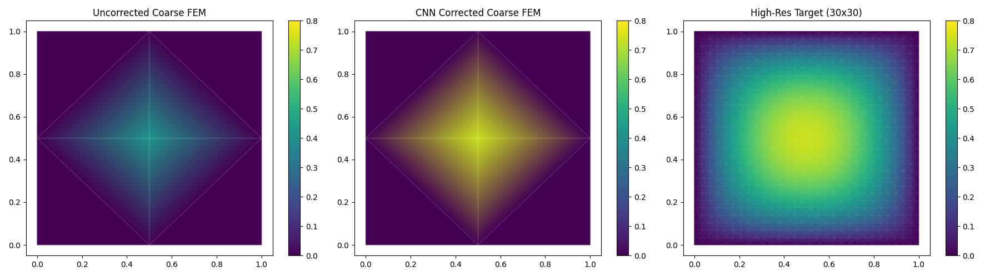
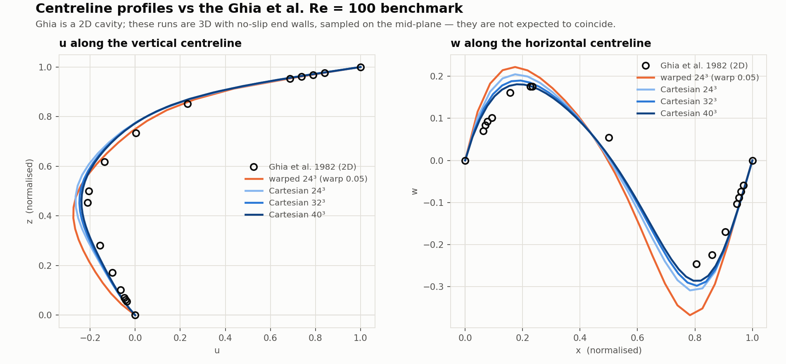

# Learning PICT: a pure-Python PISO solver

An educational, from-scratch re-implementation of the numerical core of
**[PICT](https://github.com/tum-pbs/PICT)** in plain Python/NumPy/SciPy — written to
*understand* a production CFD solver by rebuilding it, one validated phase at a time.

> **This is not PICT, and it is not affiliated with its authors.** No PICT source is
> redistributed here. Where this port mirrors a PICT design decision, the corresponding
> C++/CUDA function and line number is cited so you can look it up upstream. See
> [NOTICE](NOTICE).

---

## What is PICT?

PICT is a **differentiable, GPU-accelerated, multi-block PISO solver** for incompressible
fluid dynamics, from the TUM Physics-based Simulation group — published in the *Journal of
Computational Physics*
([paper](https://doi.org/10.1016/j.jcp.2025.114433) · [arXiv](https://arxiv.org/abs/2505.16992)).

What makes it notable:

- **2nd-order PISO** on flexible, deformed **multi-block curvilinear** domains
- **Differentiable end-to-end** — implemented as PyTorch CUDA extensions, so gradients flow
  *through the solver*, enabling simulation-coupled learning (e.g. learned turbulence models
  trained against the true solver response rather than a surrogate)
- ~18k lines of C++/CUDA, most of it in one 7k-line kernel file

That last point is the motivation for this repository. The physics is buried in hand-tuned
CUDA; the *ideas* are hard to see. So: rebuild them in NumPy, where every operator is three
readable lines, and validate each one before moving on.

## The process

### Detour first: a simple FEM Poisson solver

Before touching PISO, we built a small **finite-element Poisson solver** from scratch
([`fem_poisson/`](fem_poisson/)) as a warm-up — assembling stiffness matrices, imposing
boundary conditions, and confirming the expected convergence under mesh refinement.

<p align="center"> </p>

This established the working method that the rest of the project runs on: **never trust an
operator you have not convergence-tested.** A CNN-vs-FEM comparison
([`cnn_fem_poisson.py`](fem_poisson/cnn_fem_poisson.py)) closed out the detour.

<p align="center"></p>

### Then the pivot: port PICT's PISO core

FEM Poisson is a different discretisation from what PICT actually does (finite-volume PISO on
curvilinear grids), so we pivoted to porting the real thing —
[`piso_port/`](piso_port/) — in five phases, each gated by the **Method of Manufactured
Solutions** on a deliberately warped grid.

| Phase | What it builds | Validation | Result |
|---|---|---|---|
| 1 | Grid metrics, Jacobian, GCL | Wavy-grid MMS vs exact metrics | rate **2.05**, GCL **7e-13** |
| 2 | Curvilinear gradient & divergence | Trigo-exponential MMS | rates **2.07 / 2.12** |
| 3 | Momentum matrix (SOU advection + diffusion) | 3D Taylor-Green | rates **2.15 / 2.46** |
| 4 | Pressure Poisson (27-pt, deferred correction) | Trigo-exponential Laplacian | rates **2.14 / 2.30** |
| 5 | PISO orchestration | Lid-driven cavity, Taylor-Green | divergence **~1e-10** |

**Layout follows PICT, which is *collocated*:** pressure and velocity both live at cell
centres (`Block::CreatePressure` / `CreateVelocity` build tensors on the same grid). Only the
metric transforms are face-staggered. Face fluxes are a *derived* quantity, interpolated from
cell-centred contravariant components — and PICT uses **no Rhie–Chow interpolation**.
Consistency comes instead from expressing divergence and the pressure operator on the *same*
faces.

## Results

3D lid-driven cavity on a warped curvilinear grid, at steady state:

<p align="center"></p>
<p align="center"></p>

The 3D streamlines are integrated in *computational* space (`dξⁱ/ds = Uⁱ/|U|`), where the
grid is uniform and interpolation is exact, then mapped back — avoiding any need to invert
the warped physical→computational map.

### Against the Ghia benchmark

<p align="center"></p>

Ghia et al. (1982) is a **2D** benchmark; ours is a **3D** cavity with no-slip end walls, so
these are not the same problem and exact agreement would be suspicious. Refinement moves us
monotonically toward it (RMS deviation 0.035 → 0.030 → 0.028 for 24³/32³/40³), but
extrapolates to a non-zero residual — and that residual sits in the **core** (RMS 0.039), not
at the walls (0.014), which is where our scheme's known 1st-order treatments live. A proper
validation needs a *3D* cubic-cavity benchmark; that is open work.

## Things this exercise surfaced

The interesting output was less the code than the failure modes. Each of these was measured,
not guessed:

- **A hang that was really a symmetry bug.** The Poisson solve never terminated. Cause: the
  matrix was not symmetric (cell-centred coefficients on both neighbours, plus identity-row
  Dirichlet stamping), so CG *cannot* converge — it ran to `maxiter = 10N` with a residual
  worse than the zero guess. Fixing symmetry took it from non-terminating to **0.24 s**.
- **A test that passed for the wrong reason.** Phase 3 hit 2nd order only because it used a
  grid warp 10× milder than Phase 1's. At realistic skew the rate collapsed to **0.42**. The
  implicit matrix dropped the Jacobian weighting while the deferred correction kept it, so the
  two halves did not reconstruct the same Laplacian — the split's error *did not converge at
  all*.
- **A suite that reported 23/23 while containing garbage.** The convergence check looked only
  at the last refinement rate, so a blown-up intermediate point slipped through. Tightening it
  exposed a second hole (a blown-up *first* point still passed as monotone). The criterion now
  requires all rates in [1.8, 4.0] plus monotone decrease, meta-tested against five known
  failure shapes.
- **A "remedy" that was implemented, measured, and deleted.** Deferred correction stops
  contracting past warp ≈ 0.18 (ratios 0.31 / 0.59 / 0.92 / **1.27**). The over-relaxed
  implicit-boost fix leaves the fixed point unchanged and merely drives the iteration toward
  the identity — converging *slower*. Removed rather than shipped.
- **A boundary default that quietly destroyed the solution.** Zeroing boundary face fluxes
  gave a discrete divergence of **1.8e+01** on an *exactly* divergence-free field; the
  projection then "corrected" that phantom divergence and wrecked the interior.

## Second-order in time

The default scheme is non-incremental (Chorin) projection, matching PICT's
`apply_pressure_gradient = False`. That is **1st order**, and no time integrator repairs it —
the splitting error is O(Δt). Adding the **rotational** correction

$$p^{n+1} = p^n + \phi - \nu\,(\nabla\cdot\mathbf{u}^{*})$$

together with BDF2 recovers 2nd order. Measured against a same-grid numerical reference
(so the spatial error cancels exactly):

| scheme | time | observed order |
|---|---|---|
| chorin | BE | 1.01 |
| chorin | BDF2 | 1.08 &nbsp;*(splitting-limited, as theory says)* |
| rotational | BDF2 | **1.91, 1.94, 1.97** |

Full derivation in [`piso_port/reference/piso_equations.md`](piso_port/reference/piso_equations.md).

## Running it

Requires `numpy`, `scipy`, `sympy`, `matplotlib`. We use [uv](https://docs.astral.sh/uv/):

```bash
cd piso_port

uv run phase1_grid_metrics.py      # each phase self-validates via MMS
uv run phase2_operators.py
uv run phase3_momentum.py
uv run phase4_poisson.py

uv run test_phase3_rigorous.py     # 23 checks: warp x viscosity sweeps, independent solver
uv run test_phase5_piso.py         # 10 checks: projection exactness, cavity, Taylor-Green
uv run test_phase5_order.py        #  5 checks: temporal order, periodic and walled

uv run run_cavity.py && uv run plot_cavity.py     # reproduce the figures
```

## Documentation

| Document | Contents |
|---|---|
| [`piso_equations.md`](piso_port/reference/piso_equations.md) | Every equation as implemented, with PICT line-number cross-references; the non-orthogonal lag, its treatment, and the rotational correction |
| [`implementation_plan.md`](piso_port/reference/implementation_plan.md) | The original five-phase plan and MMS pass criteria |
| [`walkthrough.md`](piso_port/reference/walkthrough.md) | Phase 1–3 narrative |
| [`phase5_plan.md`](piso_port/reference/phase5_plan.md) | PISO design, and the collocated-vs-staggered investigation |
| [`piso_backprop_math.md`](piso_port/reference/piso_backprop_math.md) · [`adjoint_method.md`](piso_port/reference/adjoint_method.md) | Differentiability notes — how gradients pass through a PISO step |

## Status and limitations

Honest about what this is:

- Single block only — no multi-block coupling
- CPU/NumPy — no GPU, no autodiff (PICT's headline feature)
- Deferred correction limited to grid warp ≲ 0.15; it warns rather than returning junk
- Wall treatment is 1st order (half-cell boundary-flux stencil), so wall-bounded runs do not
  reach 2nd order even with the rotational term
- Not validated against a 3D cavity benchmark yet

## Licence & attribution

Apache 2.0, matching upstream. PICT is the work of its authors at TU Munich; please cite the
JCP paper if you build on the ideas. See [NOTICE](NOTICE).
