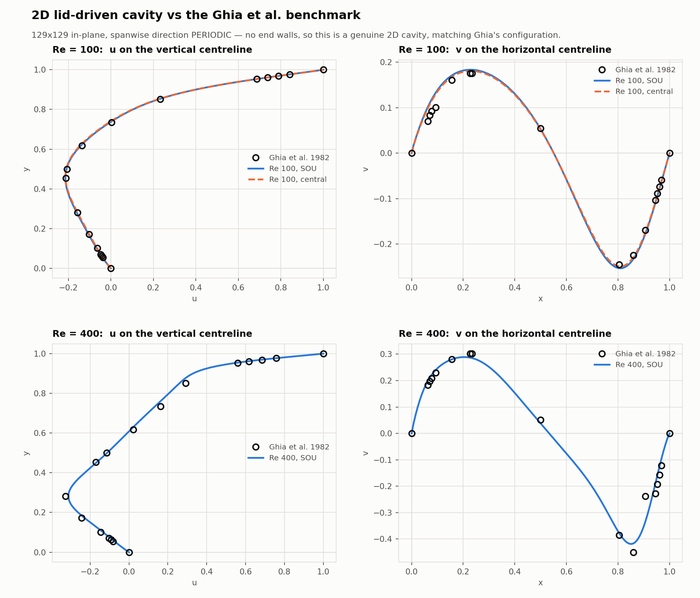
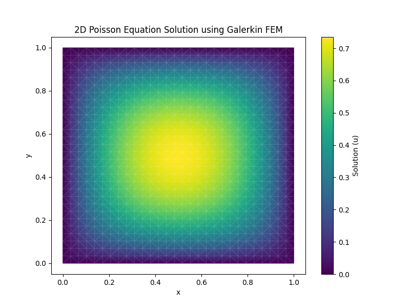
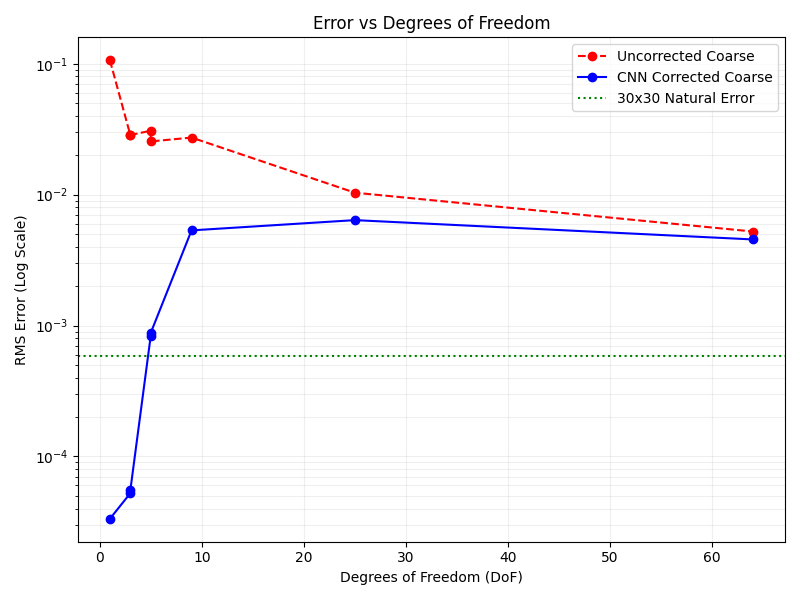
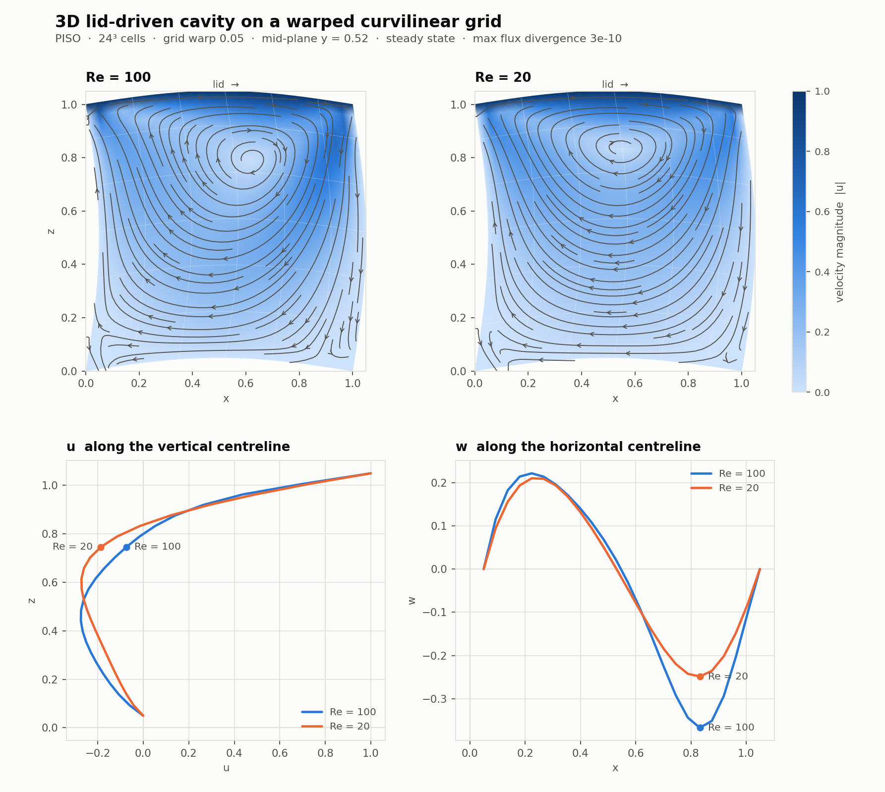
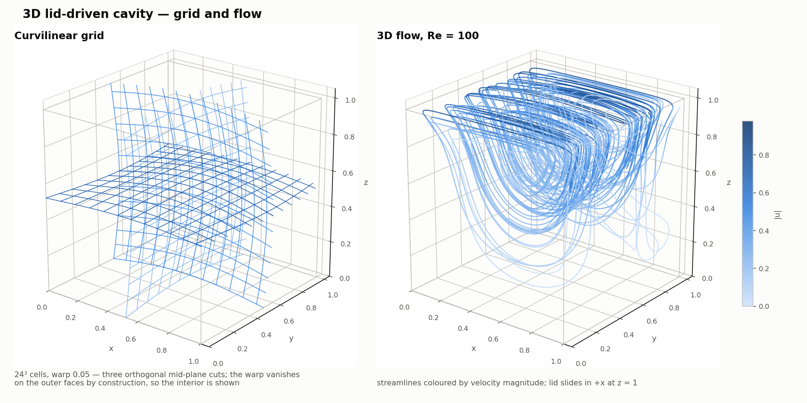
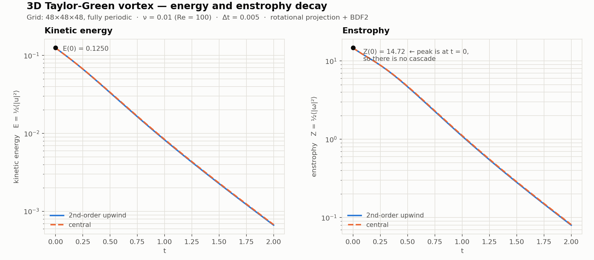
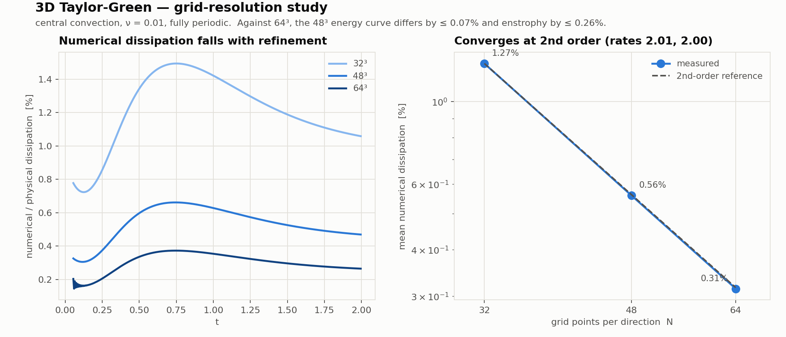
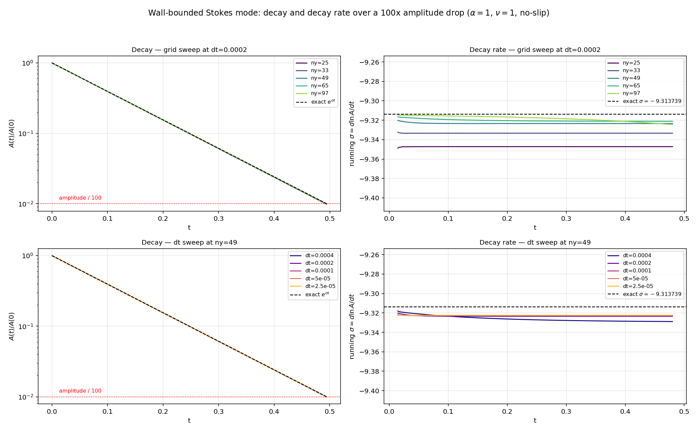

# Learning PICT: a pure-Python, differentiable PISO solver

An educational, from-scratch re-implementation of the numerical core of
**[PICT](https://github.com/tum-pbs/PICT)** in plain Python/NumPy/SciPy — written to
*understand* a production CFD solver by rebuilding it, one validated phase at a time, and then
making it differentiable so a neural network can be trained through it.

> **This is not PICT, and it is not affiliated with its authors.** No PICT source is
> redistributed here. Where this port mirrors a PICT design decision, the corresponding
> C++/CUDA function and line number is cited so you can look it up upstream. See
> [NOTICE](NOTICE).

---

## What is PICT?

PICT is a **differentiable, GPU-accelerated, multi-block PISO solver** for incompressible fluid
dynamics, from the TUM Physics-based Simulation group — published in the *Journal of
Computational Physics*
([paper](https://doi.org/10.1016/j.jcp.2025.114433) · [arXiv](https://arxiv.org/abs/2505.16992)).

- **2nd-order PISO** on deformed **multi-block curvilinear** domains
- **Differentiable end-to-end** — PyTorch CUDA extensions, so gradients flow *through the
  solver*, enabling simulation-coupled learning
- ~18k lines of C++/CUDA, most of it in one 7k-line kernel file

That last point is the motivation. The physics is buried in hand-tuned CUDA; the *ideas* are
hard to see. So: rebuild them in NumPy, where every operator is a few readable lines, and
validate each one before moving on.

---

## Headline results

| | measured |
|---|---|
| Discrete Geometric Conservation Law | **7e-13** (machine precision) |
| Spatial order, full solver | **2.02, 2.00, 2.00** (warped periodic) |
| Temporal order, full solver | **1.91, 1.94, 1.97** (rotational projection + BDF2) |
| Flux divergence after projection | **~1e-12 – 1e-10** |
| 2D cavity vs Ghia et al. Re=100 | RMS deviation **0.0033** (u), **0.0072** (v) |
| Numerical dissipation (3D TGV) | **1.10%** SOU vs **0.56%** central, converging at 2nd order |
| Wall-bounded Stokes eigenvalue | **-9.313739** reproduced to **4.7e-4** (no closed form exists) |
| Inviscid energy conservation, central | **1e-16** — exact to round-off |
| Inviscid energy loss, SOU | **10.35%** of E per turnover on a broadband field |
| Adjoint vs finite differences | agrees to **~7 digits** through a full PISO step |
| Automated checks | **165**, all passing |

<p align="center"></p>

---

## The process

### A detour first: FEM Poisson

Before touching PISO we built a small **finite-element Poisson solver**
([`fem_poisson/`](fem_poisson/)) as a warm-up, confirming the expected convergence under mesh
refinement.

<p align="center"> </p>

This established the working method the whole project runs on: **never trust an operator you
have not convergence-tested.**

### Then the port: five phases, each gated by MMS

FEM Poisson is a different discretisation from what PICT does, so we pivoted to porting the
real thing — [`piso_port/`](piso_port/) — with each phase gated by the Method of Manufactured
Solutions on a deliberately warped grid.

| Phase | What it builds | Result |
|---|---|---|
| 1 | Grid metrics, Jacobian, GCL | rate **2.05**, GCL **7e-13** |
| 2 | Curvilinear gradient & divergence | **2.07 / 2.12**, holds to warp 0.20 |
| 3 | Momentum matrix (SOU or central + diffusion) | **2.15 / 2.46** |
| 4 | Pressure Poisson (27-pt, deferred correction) | **2.14 / 2.30** |
| 5 | PISO orchestration | flux divergence **~1e-10** |

**Layout follows PICT, which is *collocated*:** pressure and velocity both at cell centres;
only the metric transforms are face-staggered. Face fluxes are *derived*, and PICT uses **no
Rhie–Chow interpolation** — consistency comes from expressing divergence and the pressure
operator on the *same* faces.

### Then: capability beyond the original plan

- **Periodic boundaries** on any axis — GCL holds at **1.6e-14** on a fully periodic warped grid
- **Non-cubic grids** — a thin periodic spanwise direction turns the 3D solver into a genuine
  2D cavity, which is what makes the Ghia comparison apples-to-apples
- **Rotational projection + BDF2** — recovers 2nd order in time
- **Central convection** alongside 2nd-order upwind
- **Differentiability** — discrete adjoint through the whole step, verified against finite
  differences

---

## Validation gallery

3D lid-driven cavity on a warped curvilinear grid:

<p align="center"></p>
<p align="center"></p>

3D Taylor-Green energy budget — the exact periodic identity $-\mathrm{d}E/\mathrm{d}t = 2\nu Z$
turns any gap into a direct measure of the scheme's numerical dissipation:

<p align="center"></p>
<p align="center"></p>

---

## Stokes flow: verifying the *spectrum*, not just the solution

MMS verifies that each operator approximates its differential counterpart. Ghia, Poiseuille and
the duct verify that the solver reproduces known *solutions*. Neither checks the property that
decides whether a disturbance in a real calculation grows or dies: **the spectrum of the linear
operator**. A scheme can track a decaying solution to plotting accuracy while getting its
eigenvalue wrong by percent — invisible in a solution comparison, decisive for stability work.

The unsteady Stokes equations have exact eigenvalues, so this can be measured directly.

**Periodic box** — closed form $\sigma = -\nu|k|^2$. Five modes including a pure shear mode
(1,0) and obliques, worst error **1.2e-2**. Spatial order 1.89/1.95/1.97; temporal order
**0.99** (Chorin/BE) and **2.01** (rotational/BDF2), against design orders 1 and 2. A superposed
three-mode disturbance has every mode decay at *its own* rate to ~1%, though the fastest decays
6.5x quicker than the slowest — so the solver reproduces the whole spectrum, not one eigenvalue.

**Wall-bounded channel** — $\sigma = -9.313739$, which has **no closed form**: it is the root of
a transcendental condition, referenced here against a Chebyshev clamped-$D_4$ eigensolve.
Reproduced to **4.7e-4** at 65x48, spatial order 2.07/2.11/2.35.

<p align="center"></p>

Three findings, none of which the periodic case alone could produce:

- **Second order in time holds for NEAR-LINEAR flows only, unless `picard_iters=2`.** This
  case has perturbation amplitude 1e-4, so convection is negligible and the O(Δt) lag in the
  convecting velocity costs nothing. With convection active that lag dominates and the order
  falls to ~1.1 — see
  [`second_order_convective.md`](piso_port/reference/second_order_convective.md).
- **~~The scheme is not second order in time for wall-bounded flow~~ — RETRACTED.** This
  previously read "1.68 with walls versus 2.01 periodic", blamed on the $O(\Delta t^{3/2})$
  near-wall splitting error of rotational projection. It was wrong: 1.68 came from one
  Richardson triple measured outside the asymptotic range. Refining gives orders
  **0.80 → 1.68 → 2.00** across successively finer triples, so the scheme **is** second order in
  time with walls. Caught by replicating an independent spectral-element solver
  ([`test_chan_channel.py`](piso_port/test_chan_channel.py)) that reported 1.94–1.99 on this
  exact problem. A plausible physical explanation made a measurement artifact look settled.
- **The spatial and temporal errors have opposite signs** (spatial over-damps, temporal
  under-damps). In the 5x5 error matrix the single best entry is the **coarsest** time step at
  the finest grid, and refining $\Delta t$ from there nearly doubles the error. Single-parameter
  refinement studies are actively misleading here — refine both together.
- **There is no numerical-dissipation floor.** The $\Delta t \to 0$ column converges to zero at
  order 1.91–1.97, and periodic modes come out *under*-damped while walled ones are
  *over*-damped — a dissipative mechanism cannot flip sign with the boundary condition.

This also found a real solver defect: `compute_numerical_metrics` never passed `period` through
to `wrap_pad_coords`, so any periodic domain of length $\neq 1$ — such as the $2\pi$ box this
case needs — would have had a corrupted seam and a collapsed Jacobian.

Full detail: [`stokes_verification.md`](piso_port/reference/stokes_verification.md).

---

## Does the convective scheme conserve energy?

The property that governs whether a scheme can carry a turbulent cascade — and the one thing
none of the tests above check, because every one of them is linear or steady.

For $\nu = 0$ with periodic boundaries, convection must redistribute kinetic energy without
creating or destroying it. Discretely that holds only if the convective operator is
**skew-symmetric**. The momentum assembler with $\nu = 0$ *is* the volume-integrated convective
operator, so the energy production rate
$P = \sum_c \mathbf{u}_c\cdot(C\,\mathbf{u}_c)\,\mathrm{d}V$ can be measured directly.

| $n=48$ | Taylor-Green | random solenoidal |
|---|---|---|
| `central`, $\varepsilon = P/E$ | **-5.8e-18** | **+1.2e-16** |
| `sou`, $\varepsilon = P/E$ | 5.36e-3 (0.54%/turnover) | 9.60e-2 (**10.35%**/turnover) |
| `sou` convergence | $h^{2.99}$ | $h^{2.86}$ |

**`central` conserves energy exactly** — at round-off, on both fields and every grid. The
operator is discretely skew-symmetric, which is the prerequisite for a cascade.

**`sou` removes 10.35% of the kinetic energy per eddy turnover** on the broadband field, against
0.54% on smooth Taylor-Green. That gap *is* the finding: upwind dissipation scales with
small-scale content, and turbulence is nothing but small-scale content.

Run inviscid TGV past resolution and the two split in opposite directions — `central`
accumulates +3%, `sou` removes -3.5%. Neither is a defect: an energy-conserving scheme with no
SGS model piles energy at the grid scale, and that pile is exactly what a closure exists to
remove. `sou`'s dissipation happens to cancel it, which is precisely what makes it a **polluted
baseline** — it looks stable while quietly doing the closure's job.

> **Consequence:** `convection='central'` is mandatory for any LES or SGS-learning use of this
> solver. With `sou` the numerical dissipation sits an order of magnitude above a typical SGS
> contribution and would swamp whatever a network learns.

---

## Differentiability: coupling a CNN to PISO

The adjoint of a PISO step is dominated by two linear solves that behave **completely
differently**, and getting that distinction wrong is the classic failure:

| | velocity ($A$) | pressure ($M$) |
|---|---|---|
| symmetric | **no** — SOU is one-sided (measured $\lVert A - A^{\mathsf T}\rVert = 12.4$) | **yes**, exactly |
| adjoint operator | $A^{\mathsf T}$, a *different* matrix | $M$ itself |
| Krylov method | BiCGStab both ways | CG both ways |
| preconditioner | reuse $LU$ **transposed** | reuse verbatim |
| singular | no | **yes** — constant null space |

Forgetting the transpose on the momentum matrix is a **24.5% error**, not a rounding one.

Built and verified in six stages, each gated on a **gradient check, not a falling loss**:

| Stage | What | Result |
|---|---|---|
| 0 | linear-solve adjoint | FD to ~7 digits; null-space invariance 8.9e-16 |
| 1 | one step, one scalar | recovers $c_{\text{true}}=0.7$ to 10 digits |
| 2 | tiny CNN, 173 weights | FD on **every** weight: **4.6e-08** |
| 3 | 5-step rollout + checkpointing | checkpointed ≡ non-checkpointed **exactly**; 17× memory saving |
| 4 | frozen-coefficient bias | angle 0.4° **but converged loss 25% worse** → use `exact_A` |
| 5a | a-priori SGS regression | held-out correlation **0.850** |
| 5b | a-posteriori closure training | (b),(c) pass; (a) unreachable — see below |

---

## What this exercise actually surfaced

The most useful output was not the code but the failure modes. Every one was **measured**, and
several overturned a criterion we had written ourselves.

**A hang that was really a symmetry bug.** The Poisson solve never terminated. The matrix was
not symmetric, so CG *cannot* converge — it ran to `maxiter = 10N` with a residual worse than
the zero guess. Fixing symmetry took it from non-terminating to **0.24 s**.

**A test that passed for the wrong reason.** Phase 3 hit 2nd order only because it used a grid
warp 10× milder than Phase 1's. At realistic skew the rate collapsed to **0.42**: the implicit
matrix dropped the Jacobian weighting while the deferred correction kept it, so the split's
error did not converge at all.

**A suite reporting 23/23 while containing garbage.** The convergence check looked only at the
last refinement rate, so a blown-up intermediate point slipped through. Tightening it exposed a
second hole. The criterion now requires all rates in a band *plus* monotone decrease,
meta-tested against five known failure shapes.

**A remedy implemented, measured, and deleted.** The over-relaxed implicit-boost fix for the
deferred-correction warp limit leaves the fixed point unchanged and merely drives the iteration
toward the identity — converging *slower*. Removed rather than shipped.

**A boundary default that quietly destroyed the solution.** Zeroing boundary face fluxes gave a
discrete divergence of **1.8e+01** on an *exactly* divergence-free field; the projection then
"corrected" that phantom divergence and wrecked the interior.

**A gradient criterion that was insufficient (Stage 4).** The plan said to accept the
frozen-coefficient shortcut if the gradient angle is under 5°. The angle is **0.4°** — yet the
converged loss is **25% worse**. A small systematic bias barely tilts the gradient at any one
point but accumulates over the optimisation. The converged-loss comparison is the binding test;
the angle is only a cheap screen.

**An improvement target that was unreachable (Stage 5b).** Gate (a) wanted a 30% trajectory
improvement and got 2.7%. Measuring the **oracle** — a rollout with the *exact* sub-grid force —
gives **−0.3%**: no closure, however perfect, can beat that. The sub-grid term is ~6% of the
tendency while the 16³ coarse solver carries several percent of its own discretisation error.
The bar was miscalibrated, not missed. And since the trained model *beats* the oracle, it is
compensating **numerical** error rather than learning physics — the exact confound flagged when
the energy-budget stage was inserted, now demonstrated rather than hypothesised.

**A wrong prediction, corrected by measurement.** We expected Chorin + BDF2 to reach 2nd order
in time. It does not and cannot — the non-incremental splitting error is O(Δt) and no
integrator repairs it. The test now asserts 1st order there deliberately.

---

## Running it

Requires `numpy`, `scipy`, `sympy`, `matplotlib`; the differentiable parts need `torch`.

```bash
cd piso_port

# --- per-phase MMS validation
uv run phase1_grid_metrics.py
uv run phase2_operators.py
uv run phase3_momentum.py
uv run phase4_poisson.py

# --- verification suites
uv run test_phase3_rigorous.py             # 23 checks: warp x viscosity, independent solver
uv run test_phase5_piso.py                 # 10 checks: projection, cavity, Taylor-Green
uv run test_phase5_order.py                #  5 checks: temporal order, periodic and walled
uv run test_spatial_order.py               #  full-solver spatial order
uv run test_poiseuille.py                  #  plane Poiseuille vs the analytic parabola
uv run test_duct.py                        #  square duct vs the Fourier series
uv run test_channel_order.py               #  channel: spatial AND temporal order
uv run verify_discretization_examples.py   #  9 checks: doc examples vs the assembly code
uv run test_implicit_cross.py              # 10 checks: implicit vs deferred cross terms
uv run test_duct_implicit.py               # 18 checks: implicit cross vs the exact duct series
uv run test_stokes_growth.py               #  6 checks: Stokes spectrum, periodic (sigma=-nu|k|^2)
uv run test_stokes_channel.py              #  5 checks: wall-bounded Stokes eigenvalue -9.313739
uv run test_outflow.py                     #  inflow/outflow BCs (Dong path has a known defect)
uv run stokes_decay_study.py               #  decay + decay rate over a 100x amplitude drop
uv run stokes_error_matrix.py              #  5x5 error matrix in (resolution, dt)
uv run test_energy_conservation.py         #  6 checks: inviscid KE conservation (central vs SOU)
uv run test_multiblock.py                  # 42 checks: seam ops, MMS, PISO step, 2x2 topology
uv run test_chan_channel.py                #  4 checks: replicates an independent SEM solver (Chan 1996)
uv run test_orr_sommerfeld.py              #  2 checks: Orr-Sommerfeld growth at Re=7500

# --- differentiability
uv run --with torch adjoint_piso.py            # adjoint identity + FD gradient check
uv run --with torch nn_stage1_scalar.py        # scalar recovery
uv run --with torch nn_stage2_cnn.py           # FD on every weight
uv run --with torch nn_stage3_rollout.py       # rollout + checkpointing
uv run --with torch nn_stage4_bias.py          # frozen-coefficient bias

# --- closure learning (generates data first, a few minutes)
uv run make_sgs_data.py && uv run --with torch nn_stage5a_apriori.py
uv run make_sgs_trajectory.py && uv run --with torch nn_stage5b_aposteriori.py

# --- figures
uv run run_cavity.py     && uv run plot_cavity.py
uv run run_cavity_2d.py  && uv run plot_ghia_2d.py
uv run run_tgv3d.py      && uv run plot_tgv3d.py
```

---

## Documentation

| Document | Contents |
|---|---|
| [`piso_equations.md`](piso_port/reference/piso_equations.md) | Every equation as implemented, with PICT line-number cross-references; the non-orthogonal lag and the rotational correction |
| [`spatial_discretization.md`](piso_port/reference/spatial_discretization.md) | Each operator — SOU and central convection, conservative diffusion, both divergence operators — with worked numerical examples *and the real code* |
| [`accuracy_verification.md`](piso_port/reference/accuracy_verification.md) | How spatial and temporal orders were established, why they must be measured separately, and the energy-budget check convergence rates cannot give you |
| [`nn_piso_coupling.md`](piso_port/reference/nn_piso_coupling.md) | The discrete adjoint: why velocity needs a genuine transpose solve, pressure does not, and how to handle its singular null space |
| [`nn_piso_plan.md`](piso_port/reference/nn_piso_plan.md) | The six-stage CNN coupling plan, with test problems, acceptance criteria, and the two criteria the measurements overturned |
| [`second_order_convective.md`](piso_port/reference/second_order_convective.md) | **What actually has to be true to keep second order once convection is active** — the two O(dt) errors that sit in front of BDF2, why `central` is mandatory, and the five ways a convergence-order measurement can lie to you (each of which produced a wrong published conclusion here first) |
| [`stokes_verification.md`](piso_port/reference/stokes_verification.md) | Both Stokes eigenvalue problems in full — setup, methodology, the 5x5 error matrix, the opposite-sign error finding, and the defects the tests exposed (including four in the tests themselves) |
| [`outflow_bcs.md`](piso_port/reference/outflow_bcs.md) | Inflow/outflow: what PICT actually does (and the cell-centred factor of 2 that does not transfer to a node-on-boundary grid), both treatments, results, and the diagnosis of the Dong defect — including the first hypothesis that turned out wrong |
| [`multiblock_offsets.md`](piso_port/reference/multiblock_offsets.md) | How PICT joins blocks: the global index space, CSR offsets, and the axis-permutation connection map — with diagrams. PICT uses **no ghost cells**; coupling is implicit in one global matrix |
| [`implementation_plan.md`](piso_port/reference/implementation_plan.md) · [`walkthrough.md`](piso_port/reference/walkthrough.md) · [`phase5_plan.md`](piso_port/reference/phase5_plan.md) | The original plan, the Phase 1–3 narrative, and the collocated-vs-staggered investigation |

---

## Status and limitations

Honest about what this is and is not:

- **Single block**, no multi-block coupling
- **CPU/NumPy** — no GPU; differentiability is via a small PyTorch layer, not CUDA extensions
- **Deferred correction limited to grid warp ≲ 0.15** — the Picard iteration stops contracting
  beyond it (ratios 0.31 / 0.59 / 0.92 / **1.27** at warp 0.05 / 0.10 / 0.15 / 0.20). It warns
  rather than returning a quietly wrong field
- **Unsteady wall-bounded cases lose time accuracy** to the projection boundary layer. The
  *spatial* wall treatment is 2nd order (square duct: 2.06, 2.04 against the analytic series)
- **Chorin projection is the default** (matching PICT), so the default is 1st order in time.
  `scheme='rotational', time_scheme='bdf2'` gives 2nd order, on periodic *and* wall-bounded
  domains. It requires `pressure_coef='rowsum'` (now the automatic default for it) — with the
  diagonal coefficient the accumulating schemes diverge
- **Curvilinear grids need more than 2 PISO correctors** to reach the asymptotic temporal rate:
  at warp 0.10, corr=2 gives ~0.8 and corr=8 gives 2.09. This is splitting error, not a change
  of order
- **`exact_A` is not fully exact** — $\Gamma = J/A_\text{diag}$, and hence $M$ and $G$, are
  still detached, which is the residual ~2% against finite differences
- **Closure learning is not demonstrated** — at reachable resolutions the coarse solver's own
  discretisation error dominates the sub-grid term, so there is nothing for a closure to learn.
  The adjoint machinery is verified; the *physics* of closure is not

## Licence & attribution

Apache 2.0, matching upstream. PICT is the work of its authors at TU Munich; please cite the
JCP paper if you build on the ideas. See [NOTICE](NOTICE).
