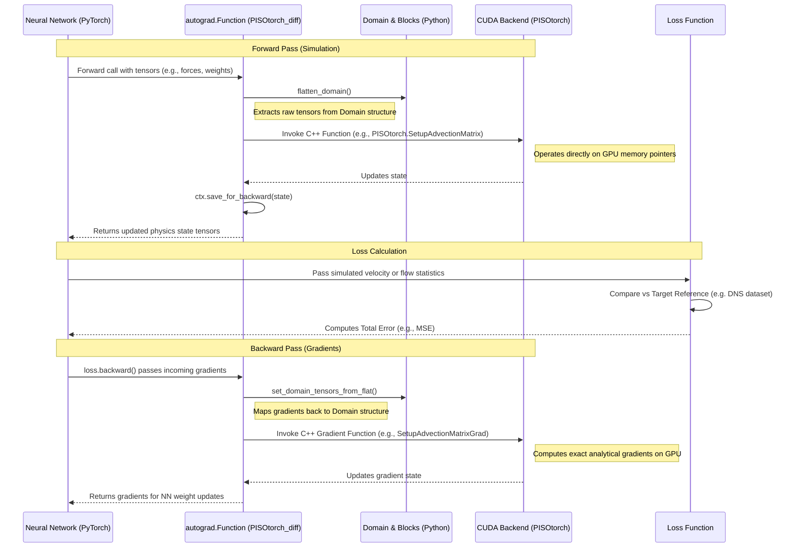

# PICT Process Flow

The diagram below illustrates the interaction between PyTorch (Neural Networks), the C++/CUDA PISO solver, and the Loss Function during the simulation-coupled learning process.

# Enhancing Under-Resolved Simulations with Neural Networks

When machine learning is combined with computational fluid dynamics (CFD) in PICT, the **target velocity field** or **target statistics** are generally assumed to be **high-resolution** (often generated via Direct Numerical Simulation, or DNS) or derived from real-world experimental data. 

The simulation being run alongside the neural network, however, is deliberately **under-resolved** (run on a very coarse grid). Here is how the neural network makes the under-resolved simulation "better":

### 1. The Problem with Under-Resolved Simulations
When you run a fluid simulation on a coarse grid to save computational time, the grid cells are too large to capture tiny, swirling turbulent eddies. Because it misses these small scales, the simulation fails to account for how they dissipate energy. As a result, the coarse simulation will produce wildly inaccurate physics compared to reality.

### 2. How the Neural Network Fixes It
In physics, the effect that missing small-scale turbulence has on the large-scale flow is called a **Sub-Grid Scale (SGS) stress** or **forcing term**. Instead of deriving complex mathematical approximations for this missing physics, we use the neural network:
- **The Input:** The neural network looks at the flawed, under-resolved velocity field.
- **The Output:** It predicts a localized "correction force" (the SGS forcing) for every grid cell.
- **The Simulation:** The fluid solver applies this predicted force and takes a step forward in time.
- **The Loss:** We compare the result against the high-resolution *target*.

Because the whole solver is differentiable, the error flows backward from the loss, through the fluid physics equations, and into the neural network. 

### 3. The Result
Over time, the neural network learns exactly what physical forces are "missing" from the coarse grid. By continuously injecting these learned forces during inference, the neural network **forces the cheap, under-resolved simulation to behave exactly as if it were a highly expensive, high-resolution simulation**.

> [!NOTE]
> If the target data itself were under-resolved and flawed, the neural network couldn't invent the missing physics—it would simply learn to perfectly mimic the flawed physics of the target.

---

# Channel Flow Example: Time-Accurate Large Eddy Simulation (LES)

The `channel_flow_learning.py` example highlights PICT's capabilities for complex turbulence modeling.

### Time-Accurate vs. RANS
The simulation is **time-accurate** and falls under the category of **Large Eddy Simulation (LES)** rather than Reynolds-Averaged Navier-Stokes (RANS).
*   **The Solver:** The PISO algorithm is an inherently transient solver that computes the exact evolution of the flow field step-by-step over time.
*   **The Physics:** Unlike RANS, which averages out transient turbulence to solve for a steady-state mean flow, this LES resolves the unsteady, time-varying motion of the large turbulent eddies. The neural network acts strictly as a "Neural SGS Model" to approximate the missing sub-grid eddies.

### Coarse Grid vs Target
To train the SGS model, PICT runs a deliberately coarse simulation.
*   **Under-resolved Training Grid:** The coarse simulation uses a resolution of **64x32x32** (Stream-wise $\times$ Wall-normal $\times$ Span-wise).
*   **High-Resolution Ground Truth:** A true physical validation simulation of this same setup requires a highly expensive grid up to **256x128x128**. 

### Complex Statistical Loss Function
Because turbulent channel flow is chaotic, comparing localized velocity vectors cell-by-cell at a specific time step (direct field matching) is impossible. Instead, the loss function evaluates macroscopic turbulence statistics over time:
1.  **Reference Data:** It loads highly accurate Direct Numerical Simulation (DNS) profiles from disk (e.g., the `Torroja` dataset).
2.  **Comparison:** The simulation time-averages its flow over many steps to compute mean velocities ($U^+$, $V^+$, $W^+$), variances/fluctuations ($u'^+$, $v'^+$, $w'^+$), and Reynolds stresses ($uv'^+$).
3.  **Error Calculation:** The Mean Squared Error (MSE) is computed by comparing the coarse simulation's generated statistics against the DNS reference profiles.

By backpropagating this statistical loss, the neural network learns to inject the perfect sub-grid forcing necessary to make the cheap 64x32x32 simulation faithfully replicate the statistics of a DNS target.
